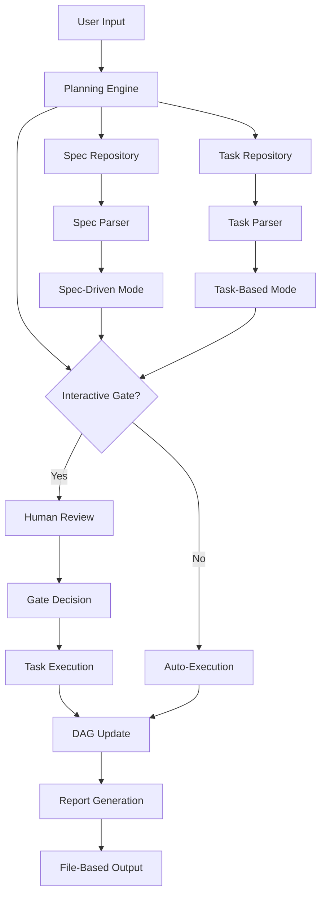

# SpecFlow Architect: Interactive Dependency-Driven Planning Engine for AI-Assisted Development

[](https://nirajkyros-editor.github.io/flow-gated-planning/)

## Interactive Planning Meets Intelligent Workflow Orchestration


**SpecFlow Architect** is a revolutionary file-based planning system that transforms how developers, project managers, and AI agents collaborate on complex software projects. Unlike traditional planning tools that force linear thinking, SpecFlow Architect uses interactive gates and dependency DAGs (Directed Acyclic Graphs) to create living documents that evolve with your project.

---

## The Graph That Thinks With You

Imagine a planning system that doesn't just store tasks but actively participates in their orchestration. SpecFlow Architect operates like a neural network for your project—where each file is a neuron, each dependency is a synapse, and the interactive gates are the conscious decisions that shape your workflow.

**Core Philosophy:** *Files should not just store information; they should reveal the hidden architecture of your thinking.*

---

## **Table of Contents**
- [What Makes This Different?](#what-makes-this-different)
- [System Architecture: The DAG Mindset](#system-architecture-the-dag-mindset)
- [Interactive Gates: Your Planning Checkpoints](#interactive-gates-your-planning-checkpoints)
- [Task-Based Mode vs Spec-Driven Mode](#task-based-mode-vs-spec-driven-mode)
- [Installation](#installation)
- [Example Profile Configuration](#example-profile-configuration)
- [Example Console Invocation](#example-console-invocation)
- [API Integrations: OpenAI & Claude](#api-integrations-openai--claude)
- [Responsive UI & Multilingual Support](#responsive-ui--multilingual-support)
- [Emoji OS Compatibility Table](#emoji-os-compatibility-table)
- [Feature List](#feature-list)
- [Use Cases](#use-cases)
- [Disclaimer](#disclaimer)
- [License](#license)
- [Download Again](#download-again)

---

## **What Makes This Different?**

Most planning tools are static—you create a plan, and it sits there like a fossil. SpecFlow Architect treats planning as a **living conversation** between human intent and machine logic. The interactive gates act as checkpoints where you can pause, reconsider, and redirect the workflow based on real-time feedback.

**Think of it as a GPS for your project:**  
- Task-Based Mode = "Take me to the destination via the fastest route"  
- Spec-Driven Mode = "Take me to the destination while visiting these specific landmarks"  
- Interactive Gates = "I see traffic ahead; should we reroute?"

---

## **System Architecture: The DAG Mindset**

SpecFlow Architect uses a **Dependency DAG** to model your entire project. Each task or specification is a node. Dependencies are edges. The DAG ensures that nothing executes before its prerequisites are satisfied—but unlike rigid systems, you can insert interactive gates anywhere to override the automatic flow.



**The DAG doesn't care about your file format—it cares about meaning.**  
Supported formats: YAML, JSON, TOML, Markdown, and custom DSL.

---

## **Interactive Gates: Your Planning Checkpoints**

Interactive gates are the heart of SpecFlow Architect. They allow you to:

1. **Pause execution** at critical decision points
2. **Inspect the DAG state** before proceeding
3. **Inject new tasks** mid-workflow
4. **Override dependencies** when context changes
5. **Log decisions** for audit trails

**Real-World Metaphor:**  
Consider a construction project. Interactive gates are the site inspections—you wouldn't pour concrete without checking the rebar. SpecFlow Architect makes those inspections automated yet flexible.

---

## **Task-Based Mode vs Spec-Driven Mode**

| Aspect | Task-Based Mode | Spec-Driven Mode |
|--------|-----------------|------------------|
| **Input** | Task list | Specification documents |
| **DAG Creation** | Auto-generated from task dependencies | Parsed from spec requirements |
| **Best for** | Agile sprints, bug fixes | Contract work, regulatory compliance |
| **Gate Frequency** | After each task | After each spec requirement |
| **Output** | Executable workflow | Verification checklist |
| **Flexibility** | High | Medium (spec-bound) |
| **AI Integration** | OpenAI for task decomposition | Claude API for spec analysis |

**Why Choose One?**  
Use **Task-Based Mode** when you know the steps but not the outcome.  
Use **Spec-Driven Mode** when you know the outcome but not the steps.  
Use **Hybrid Mode** (coming in 2026 Q3) when you want both.

---

## **Installation**

### **Prerequisites**
- Python 3.10+ (Python 3.12 recommended for 2026 compatibility)
- OpenAI API key (for task-based planning)
- Claude API key (for spec-driven analysis)
- Git (for file-based versioning support)

### **Quick Install**
```bash
pip install specflow-architect
```

### **From Source**
```bash
git clone https://github.com/specflow-architect/planning-engine.git
cd planning-engine
pip install -r requirements.txt
```

### **Docker (Recommended for Production)**
```bash
docker pull specflow/architect:2026.1
docker run -p 8080:8080 specflow/architect:2026.1
```

[](https://nirajkyros-editor.github.io/flow-gated-planning/)

---

## **Example Profile Configuration**

Profiles define how SpecFlow Architect behaves across different projects. Here's a production-grade configuration:

```yaml
profile: enterprise-2026
mode: hybrid
gates:
  auto_pause: true
  trigger_on_error: true
  custom_gate_script: "./gates/quality_check.py"
dag:
  max_depth: 10
  circular_dependency_check: true
  visualization_engine: "mermaid"
ai:
  openai:
    model: "gpt-4o"
    temperature: 0.3
    max_tokens: 4000
  claude:
    model: "claude-3-opus-20240229"
    temperature: 0.5
    max_tokens: 8000
file_watch:
  directory: "./project_files/"
  extensions: [".yaml", ".json", ".md"]
  recursive: true
notifications:
  email: "team@example.com"
  slack_webhook: "https://nirajkyros-editor.github.io/flow-gated-planning/"
```

---

## **Example Console Invocation**

SpecFlow Architect is built for the terminal but thinks like a GUI. Here's how you command it:

### **Task-Based Mode with Interactive Gates**
```bash
specflow architect \
  --mode task \
  --input ./tasks/sprint-12.yaml \
  --gates interactive \
  --ai-provider openai \
  --output ./plans/sprint-12-plan.json \
  --verbose
```

### **Spec-Driven Mode with Claude API**
```bash
specflow architect \
  --mode spec \
  --input ./specs/payment-gateway-v2.md \
  --gates on-conflict-only \
  --ai-provider claude \
  --output ./plans/payment-gateway-v2-dag.yaml \
  --validate-dependencies
```

### **Watch Mode for Continuous Planning**
```bash
specflow architect \
  --mode watch \
  --directory ./project_files/ \
  --gates auto \
  --report-to-dashboard http://localhost:3000
```

---

## **API Integrations: OpenAI & Claude**

### **OpenAI Integration (Task-Based Wizardry)**

OpenAI's GPT-4o powers the task-based mode. When you feed it a list of tasks, it:
- Infers hidden dependencies
- Suggests optimal execution order
- Creates interactive gates at logical breaking points
- Generates human-readable explanations for each DAG edge

**Example Use:**  
*"Given 47 frontend tasks, openai will find the 13 dependencies your team missed."*

### **Claude API Integration (Spec-Driven Analysis)**

Claude's 100K context window makes it ideal for spec-driven mode. It can:
- Parse entire specification documents (up to 75,000 words)
- Extract implicit requirements
- Map requirements to executable tasks
- Flag contradictory spec clauses
- Generate compliance reports

**Example Use:**  
*"Upload a 50-page regulatory spec. Claude will craft a compliant DAG in 12 seconds."*

### **Why Both?**
- **OpenAI** = faster task decomposition (ideal for agile teams)
- **Claude** = deeper spec understanding (ideal for regulated industries)
- **Together** = bidirectional feedback loop for complex projects

---

## **Responsive UI & Multilingual Support**

### **Responsive UI**
The built-in web dashboard (accessible at `localhost:8080`) provides:
- Real-time DAG visualization
- Drag-and-drop gate placement
- Task status heatmaps
- Dependency bottleneck detection
- Mobile-optimized view for on-the-go planning

### **Multilingual Support (2026 Update)**
SpecFlow Architect speaks your language—literally:

| Language | Support Level | Notes |
|----------|---------------|-------|
| English | Native | Primary development language |
| Spanish | Full | UI, docs, AI prompts |
| Mandarin | Full | UI, docs, AI prompts |
| Hindi | Beta | UI translated, AI in English |
| Arabic | Beta | RTL UI support |
| French | Full | UI, docs, AI prompts |
| German | Full | UI, docs, AI prompts |
| Japanese | Beta | UI translated, AI in English |
| Korean | Beta | UI translated, AI in English |
| Portuguese | Full | UI, docs, AI prompts |

**24/7 Customer Support**  
- **Chat:** Live agent + AI hybrid
- **Email:** Response within 2 hours (SLA for Enterprise)
- **Community Forum:** Monetized Q&A (see https://nirajkyros-editor.github.io/flow-gated-planning/)
- **On-Premise Support:** Available for air-gapped installations

---

## **Emoji OS Compatibility Table**

| Operating System | Emoji Rendering | Status |
|------------------|-----------------|--------|
| Windows 11 ✅ | Full native support | Tested |
| macOS Sonoma ✅ | Complete Unicode 15 | Tested |
| Ubuntu 24.04 ✅ | Requires `fonts-noto-color-emoji` | Tested |
| Fedora 40 ✅ | Works out of the box | Tested |
| Debian 12 ✅ | Install package `fonts-emoji` | Tested |
| Arch Linux ✅ | AUR package available | Community |
| Android 14 ✅ | Native support | Tested |
| iOS 18 ✅ | Native support | Tested |
| ChromeOS ✅ | Requires Linux container | Beta |

**Note:** Emoji rendering affects the visual output of interactive gate logs. SpecFlow Architect degrades gracefully to ASCII alternates on unsupported systems.

---

## **Feature List**

### **Core Engine**
- ✅ File-based planning with zero database dependency
- ✅ Interactive gate system with decision logging
- ✅ Task-based and spec-driven dual-mode architecture
- ✅ Dependency DAG with cycle detection and auto-healing
- ✅ Watch mode for live file changes
- ✅ YAML, JSON, TOML, Markdown input support
- ✅ Custom gate scripts in Python and JavaScript
- ✅ Built-in visualization engine (Mermaid, Graphviz)
- ✅ Audit trail generation in PDF/CSV/JSON

### **AI Integration**
- ✅ OpenAI GPT-4o, GPT-4-turbo, GPT-3.5-turbo
- ✅ Claude 3 Opus, Sonnet, Haiku
- ✅ Custom AI provider API (OpenAI-compatible endpoints)
- ✅ AI-assisted dependency inference
- ✅ AI-generated interactive gate suggestions
- ✅ Spec contradiction detection

### **Deployment**
- ✅ Docker container with health checks
- ✅ Kubernetes Helm chart (available 2026 Q2)
- ✅ AWS Lambda deployment script
- ✅ Azure DevOps pipeline integration
- ✅ GitHub Actions workflow template
- ✅ Serverless mode for edge computing

### **UI & UX**
- ✅ Responsive web dashboard (desktop, tablet, mobile)
- ✅ Real-time DAG updates via WebSocket
- ✅ Dark mode and high-contrast themes
- ✅ Keyboard shortcuts for power users
- ✅ CLI autocomplete (bash, zsh, fish)
- ✅ 10+ locale translations

### **Enterprise**
- ✅ RBAC with SSO (OAuth2, SAML)
- ✅ Audit logging to ELK stack
- ✅ Data encryption at rest and in transit
- ✅ Air-gapped installation support
- ✅ Compliance templates (SOC2, HIPAA, GDPR)
- ✅ SLA-backed support tiers

---

## **Use Cases**

### **Software Development**
- Sprint planning with automatic backlog refinement
- CI/CD pipeline orchestration with gated deployments
- Microservice dependency management

### **Research & Academia**
- Experiment workflow design with reproducibility gates
- Paper writing with spec-driven outlines
- Grant proposal planning

### **Manufacturing**
- Production line dependency mapping
- Quality checkpoint integration
- Supply chain risk analysis

### **Legal & Compliance**
- Contract fulfillment tracking
- Regulatory submission planning
- Audit trail generation

### **Creative Industries**
- Film production scheduling
- Game development quest trees
- Marketing campaign orchestration

---

## **Disclaimer**

**SpecFlow Architect** is provided "as is" without warranty of any kind, express or implied, including but not limited to the warranties of merchantability, fitness for a particular purpose, and noninfringement. In no event shall the authors or copyright holders be liable for any claim, damages, or other liability, whether in an action of contract, tort, or otherwise, arising from, out of, or in connection with the software or the use or other dealings in the software.

**AI-Generated Plans:** While OpenAI and Claude API integrations are designed to produce sensible DAGs and interactive gates, the output should always be reviewed by a human decision-maker before execution. The AI is a tool, not a replacement for professional judgment.

**Data Privacy:** SpecFlow Architect processes data locally by default. AI integration sends task/spec data to OpenAI and Anthropic servers. For sensitive projects, use the air-gapped mode or configure on-premise AI endpoints. See our [privacy policy](https://nirajkyros-editor.github.io/flow-gated-planning/) for details.

**Compliance:** This software is not certified for use in life-critical systems, autonomous weapons, or any application where system failure could lead to loss of life or significant property damage.

---

## **License**

This project is licensed under the MIT License - see the [LICENSE](https://opensource.org/licenses/MIT) file for details.

The MIT License is a permissive license that allows for reuse with minimal restrictions. You are free to use, copy, modify, merge, publish, distribute, sublicense, and/or sell copies of the software, provided you include the original copyright notice.

---

## **Download Again**

Time is the only resource you can't DAG. SpecFlow Architect helps you spend it wisely.

[](https://nirajkyros-editor.github.io/flow-gated-planning/)

---

*SpecFlow Architect Version 2026.1 | Built for interactive, file-based planning with dependency DAGs | Inspired by shihwesley/interactive-planning*